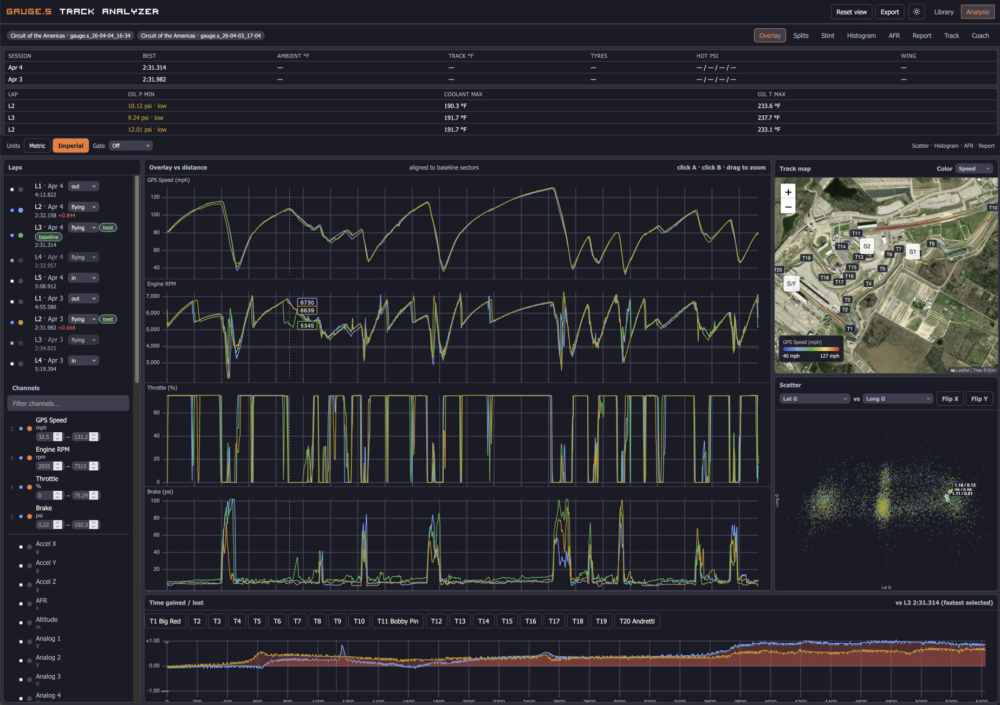
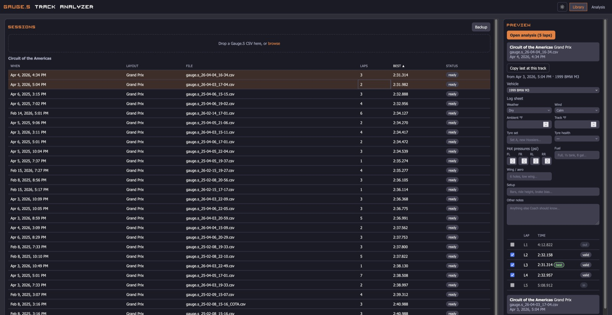
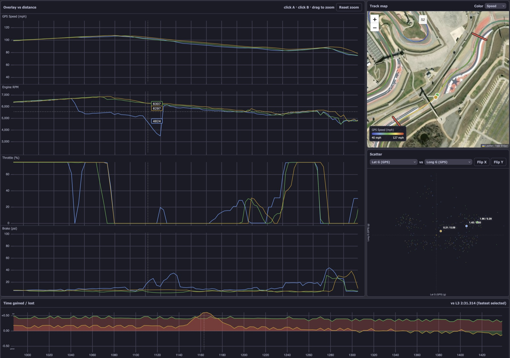
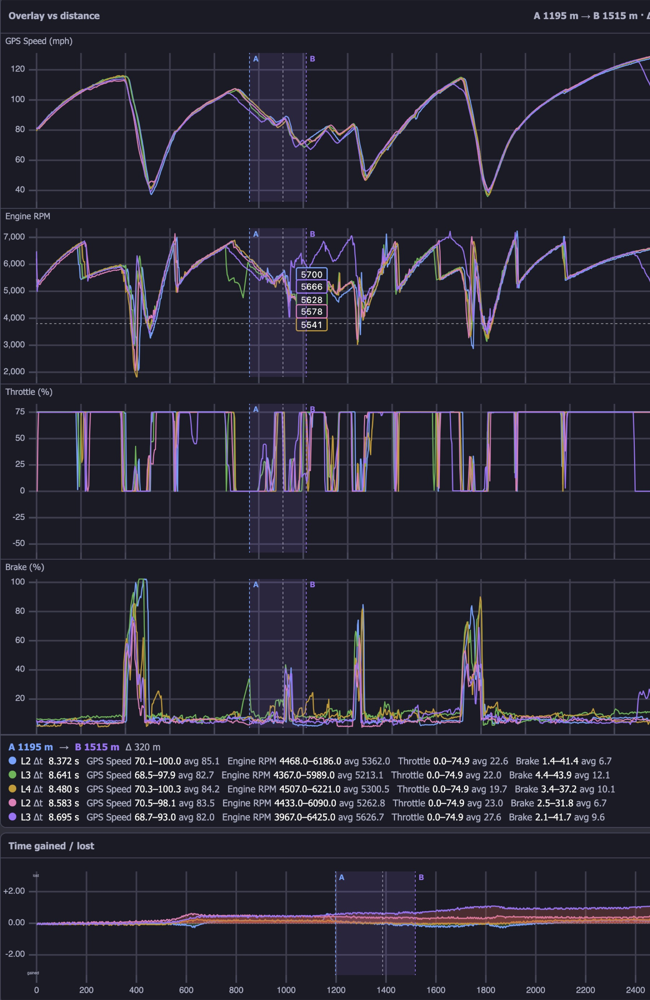
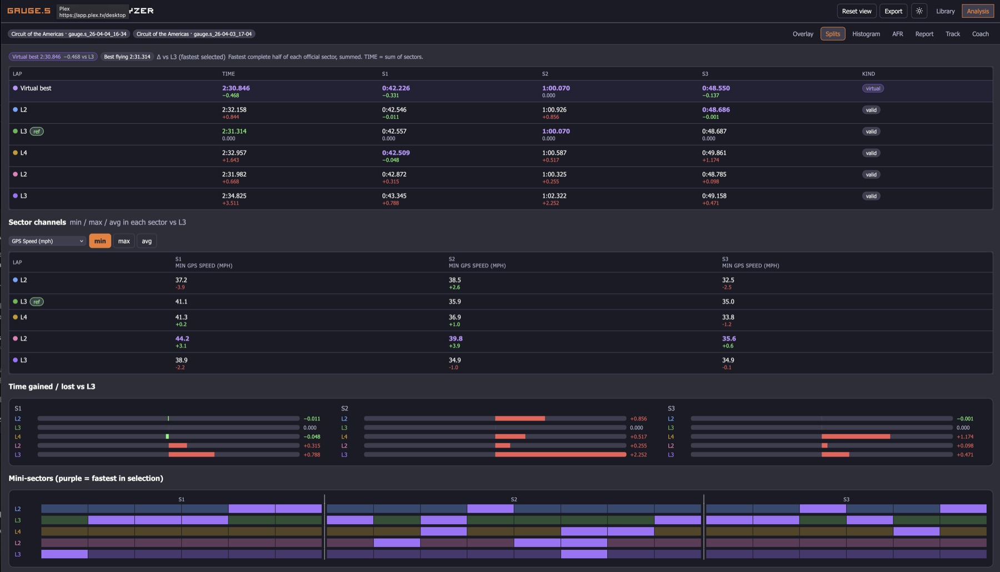
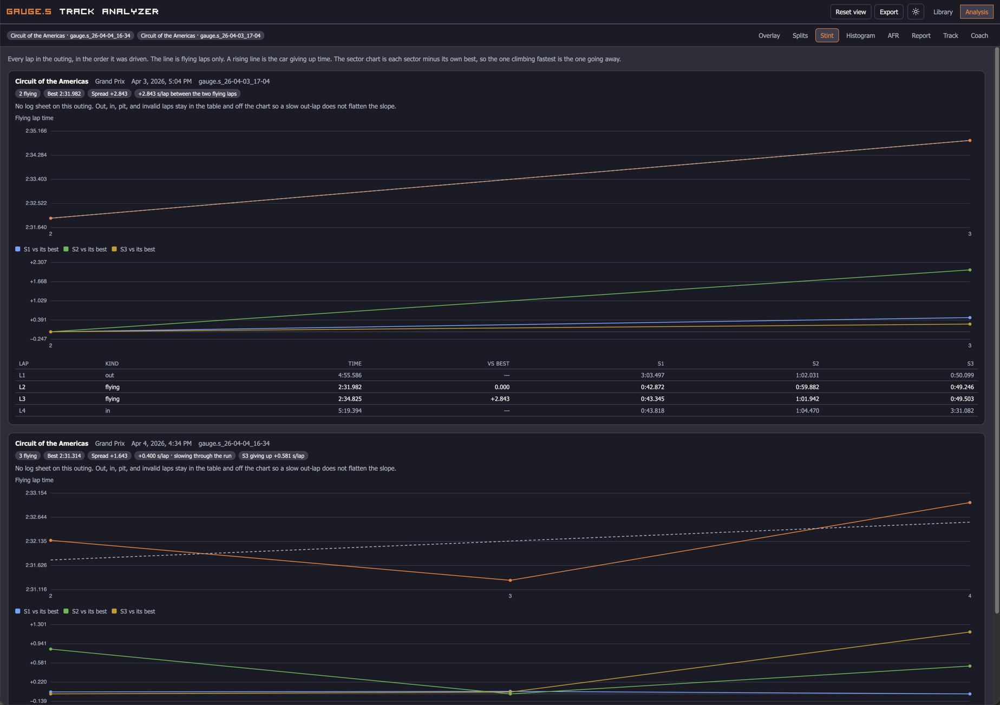
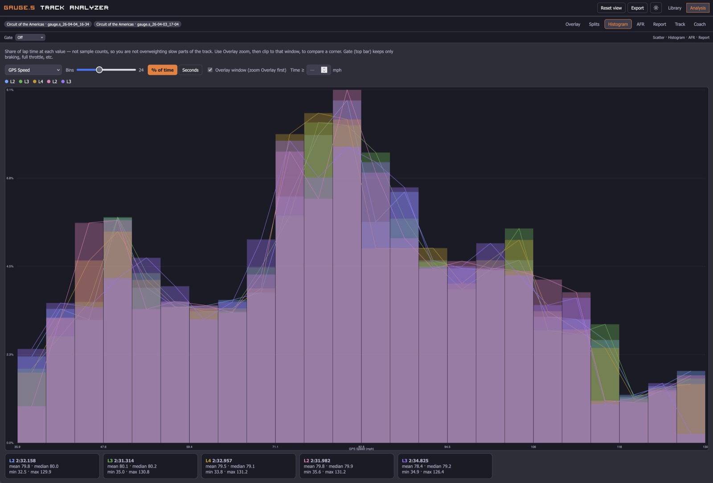
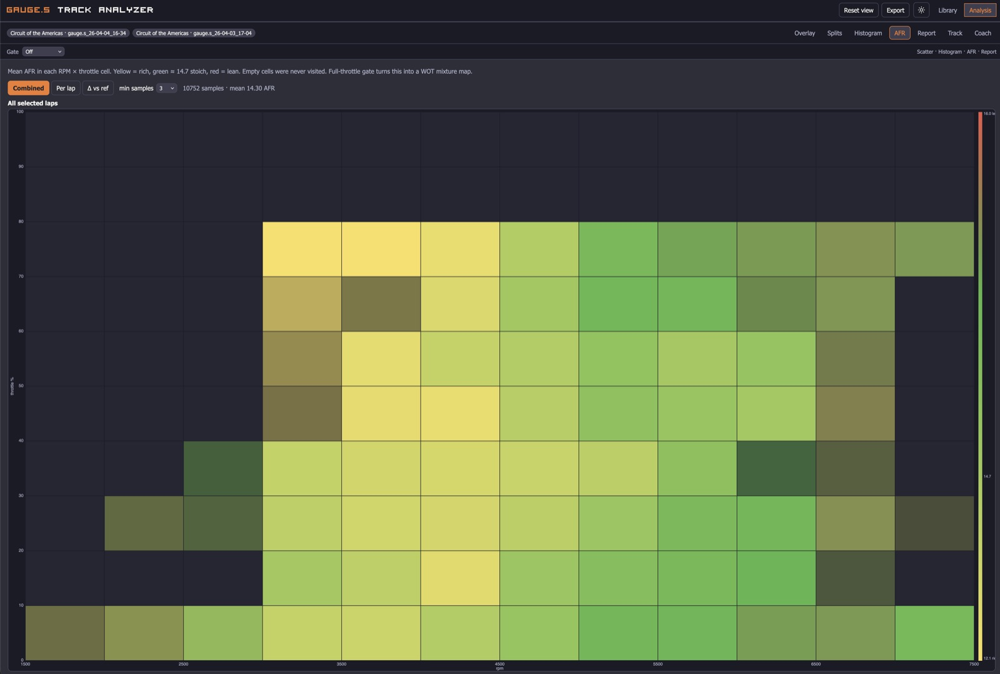
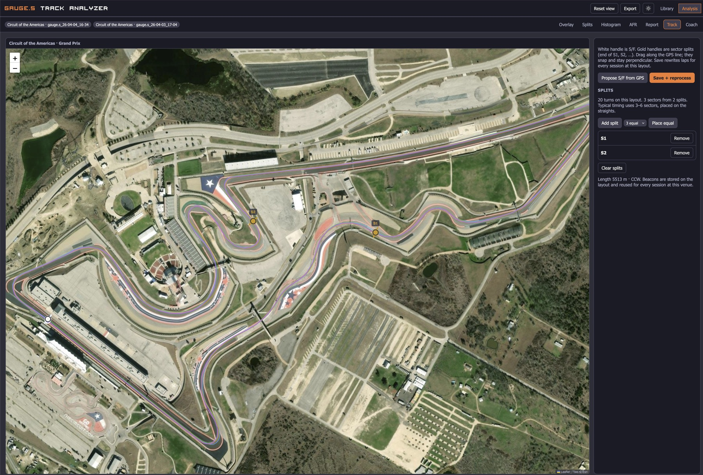

# Gauge.S Track Analyzer

**Drop a Gauge.S CSV. Walk out of the session knowing where you actually lost time.**

This is Race Studio / MoTeC-style analysis for **Gauge.S** logs: ECU + GPS in one file. You import a session, it finds flying laps, and you work the same loop a race engineer uses — overlay, satellite map, splits, scatter — then an optional AI coach that talks in **turn numbers**, not “sector 3 exit.”

You do **not** need Race Studio, MoTeC, or a Gauge.S device plugged in. You need the **CSV** the logger already wrote.

**[Live demo](https://gauges-track-analyzer-demo.cnbhome.com)** — click around COTA / Cresson logs. Uploads are wiped overnight. Reset, Restore, Delete, track edits, and lap labels are off.

Run it yourself: [http://localhost:8090](http://localhost:8090) after the Docker command below.



---

## What you need

1. [Docker](https://docs.docker.com/get-docker/) (Desktop on Mac/Windows, Engine on Linux)
2. A Gauge.S CSV from the SD card or Wi‑Fi share (**30 MB per file** max)
3. Optional: an API key if you want Coach (xAI, Groq, Meta Muse, OpenAI, or any OpenAI-compatible host)

That’s it. No database to install. One container.

---

## Run it in five minutes

```bash
git clone https://github.com/bimmerhead23/gauges-track-analyzer.git
cd gauges-track-analyzer
docker compose up --build
```

Wait until the log says the app is up, then open **[http://localhost:8090](http://localhost:8090)**.

1. You land on **Library**.
2. Drag a `.csv` onto **Drop a Gauge.S CSV here**, or click **browse**.
3. If GPS matches a known circuit and you crossed start/finish, the row shows flying-lap count and best time. Status **ready**.
4. Click the row. Preview on the right lists laps. Tick the flying laps you care about.
5. **Open analysis**. You’re on **Overlay**.

If the row says **no flying laps**, the log matched a track but never crossed a timing line (paddock, tow, missing S/F, or a point-to-point run). Keep the session, open **Track**, place the gates, then **Save + reprocess**.

If the track isn’t in the catalog, the log is still imported as a new track named from its GPS. Open **Track**, confirm the start/finish, rename it, then **Save + reprocess**. File an issue if you want that circuit in the catalog for everyone.

Stop the app with `Ctrl+C` in that terminal, or `docker compose down`. Your library lives in a Docker volume and survives rebuilds.

---

## Library

This is your session list — every CSV you’ve imported.



**Import.** Drop one or many CSVs. Header names wander (`GPS Latitude` vs `lat`, `TPS` vs throttle); the importer maps them. GPS is matched against **80+ circuits**. Laps are split **out / flying / in / pit**. A log that matches no circuit is kept as its own track (named from the GPS) so you can place gates. Known-track logs with no flying laps are kept for the same reason.

**Table.** Columns: when, layout, file, flying-lap count, best time, status. Click a header to sort. Click a row to preview. **Cmd/Ctrl-click** (Mac/Windows) to select several sessions from the same track and overlay them together.

**Preview.** Laps and times only — no sector table here. Tick laps, then **Open analysis**. **Reprocess** re-runs lap detection (after you move S/F).

**Vehicle.** Pick a saved car or **New vehicle…**. The name is reused at every track.

**Log sheet.** Weather, wind, ambient / track temp, tyre set and health, four hot pressures, fuel, wing, setup notes, and a free field for Coach. This is what the AI reads when you ask for a debrief. Temps and hot pressures follow the metric / imperial switch. They are stored as °F and psi, which is what Coach reads.

**Copy last at this track.** Copies vehicle **and** log sheet from the previous session at this venue so you are not retyping Hoosiers every run group.

**Backup.** Downloads a `.gsbak` (sessions, original CSVs, log sheets, vehicles, track edits). Keep it off-site.

**Restore…** Replaces the **entire** library with a `.gsbak`. Two confirms. Disabled on the public demo.

**Reset database.** Wipes sessions and restores the stock track catalog. Two confirms. Disabled on the demo.

**Light / dark.** Sun/moon in the header. Same data.

---

## Analysis — Overlay

Select one lap or twenty, from one day or three weekends **at the same track**. Traces are **distance-synced** onto the baseline lap's sector beacons, so the end of each sector lines up. Turn 1 on Saturday sits on Turn 1 on Sunday when the start/finish and splits are the same physical gates.



**Laps (left).** Tick to plot. The fastest flying lap in the selection is **best**. Click a lap to set **baseline** (reference for delta and splits). The label on each row is **flying**, **out**, **in**, **pit**, or **invalid**. Changing it recomputes the best lap. You do not have to move start/finish to throw out a yellow-flag lap. Out/in laps stay out of the best unless you mark them flying.

**Channels.** Search, tick to plot. Drag the grip to reorder traces. **Min / max** on a channel lock the Y-axis (example: throttle that only hits 75% — set max 75 so WOT fills the plot). **Math channels** at the bottom of the list are expressions over channel keys (`rpm`, `tps`, `brake`, `gps_speed_mph`, `wheel_speed_mph`). Three are seeded: combined G, throttle-brake overlap, and GPS speed minus wheel speed in mph. Add or delete your own. The public demo can plot them but cannot edit them.

**Health.** With laps selected, a strip shows min oil pressure while moving, max coolant, max oil temp, and AFR at full throttle. A value outside a coarse range is flagged. Channels the log does not have are omitted.

**Setups.** Two or more sessions on the overlay show a table of best lap, ambient, track temp, tyres, hot pressures, and wing.

**Units.** Overlay top bar: **Metric** or **Imperial**. Converts temps, pressures, and speeds on traces, map legend, scatter, histogram, splits, and the report.

| | Metric | Imperial |
|---|---|---|
| Temperature (oil, coolant, IAT, diff) | °C | °F |
| Oil pressure | bar | psi |
| Speed (GPS and wheel) | km/h | mph |

Gauge.S exports often leave the unit blank (`Oil temperature ()`). The importer infers from the numbers: ~90 oil is °C, ~330 oil pressure is kPa (shown as bar), ~210 GPS is km/h. Switching to Imperial converts those values; it does not relabel 90 °C as 90 °F. The choice is remembered in the browser and on the session.

**Cursor.** Hover the traces: values pop on the line, the car moves on the map, the scatter highlights. Hover the map or scatter and the traces follow.

**Zoom.** Drag on the plot to window a corner. Scroll to zoom, drag to pan, double-click to reset. The histogram / AFR / report can clip to this same window.

**Map.** Esri satellite. Color by **lap**, **speed**, **throttle**, **brake**, or **AFR**. Two or more laps → thinner lines so both stay visible. S/F and sector beacons sit on the driven line. Turn numbers from the same apex list the coach uses are drawn on the line. Drag the divider to resize the map. A GPS gap is left out of the line instead of breaking the map.

**Time gained / lost.** Bottom strip vs the baseline lap, against distance. Above the line you are slower. The turn buttons under the strip zoom the overlay to that corner.

**Scatter.** Pick two channels. Default is lateral G on X and longitudinal G on Y. Positive lateral G is a left turn and is drawn to the right. Positive longitudinal G is braking and is drawn at the top. When the log has an accelerometer, those channels are used and oriented to that same frame. **Flip X** / **Flip Y** mirror an axis. They do not swap the channels.

**A–B dual cursor.** Click once for **A**, click again for **B** (or use the hint in the plot header). You get Δt, min/max/avg speed, throttle, brake, G in that slice — on traces, map, and scatter. Right-click or Escape clears.



**Gates.** Top of Overlay: only braking, only full throttle, speed ≥ n, or your own channel / operator / value. Combine with **and**. Gates apply to overlay, histogram, AFR, scatter, and the report.

**Reset view** (header). Default channels, map, scales, gates. Overlay settings **auto-save** onto the session(s) you have open, so tomorrow looks like today.

---

## Splits

Official sectors in lap-distance order. **TIME = S1 + S2 + S3** (however many sectors you have). If the math does not add up, the S/F is wrong — fix it on **Track**. If a beacon was never crossed, the page says so: those splits are equal thirds, not the track's sectors.



**Virtual best.** Fastest complete half of each *official* sector, then summed. That is the industry “eclectic” lap, not a GPS-bin stitch that never adds up. Purple **mini-sectors** (~250 m) are a visualization of where you were fastest in the selection. They do **not** invent a lap time.

**Sector channels.** Min / max / avg of any channel (speed, throttle, brake, …) per sector vs the reference lap.

**Gain/loss bars.** Per sector vs baseline.

---

## Stint

Every lap in the outing, in the order it was driven. The line is **flying laps only**, so a slow out-lap does not flatten the picture. A rising line is the car giving up time. The number on the pill is seconds per lap.



The lower chart is each sector minus its own best flying sector. The sector climbing fastest is the one going away. Out, in, pit, and invalid laps stay in the table under the chart.

Fuel, track temp, and tyres from the log sheet are shown as context. They are not subtracted from the lap time.

---

## Histogram

Share of **lap time** at each value — not raw sample counts — so slow corners do not dominate.



Pick a channel, bin count, **% of time** or **seconds**. Tick **Overlay window** to histogram only the zoomed corner. Gates still apply.

---

## AFR

Needs a wideband channel (`wbo (AFR)` on Gauge.S). Mean AFR in each RPM × throttle cell.



Yellow = rich, green ≈ 14.7, red = lean. Empty cells were never visited. **Combined**, **per lap**, or **Δ vs ref**. Full-throttle gate turns this into a WOT mixture map.

---

## Report

Channel min / max / avg for the selected laps, after gates and optional overlay zoom. Export as PNG or CSV from the header.

---

## Track editor

Use this when catalog S/F does not match *your* line (club tracks, a different timing loop, or GPS that never crosses the published line), and for anything that is not a closed circuit.



- **Loop S/F** — one white handle. Crossing it starts the next lap (out / flying / in).
- **Point-to-point A→B** — white **A** then orange **B**. Time is the next finish after each start. Rally stages, hillclimbs, Nordschleife **bridge to gantry**, any track with no official start/finish loop.
- **Gold** handles = intermediate splits (end of S1, S2, …). Overlay distance is measured from A (or S/F).
- Drag along the GPS; they snap and stay perpendicular.
- **Propose S/F from GPS** (loop) or **Propose A/B from GPS ends** (point-to-point), **Place A / Place B**, **Add split**, **Place equal** (2–8), **Remove**. Propose only previews the gate. Nothing is written until you save.
- **Save + reprocess** recalculates every session at this layout (progress: n of N). Your edits are tagged as user-owned and are not overwritten when the catalog is reseeded. Track edits are off on the public demo.

Empty sectors default to equal thirds until you place them.

Nordschleife tourist / BTG logs should match the **Bridge to Gantry** layout automatically (start and end GPS are far apart). Switch layout in the Track sidebar if it picked the full loop instead. Place A on the bridge, B on the gantry, Save.

---

## Coach

Optional. The public demo has **no API key**, so Coach stays off there.

Coach gets a structured briefing: flying laps, sector times, virtual best, turn list, log sheet, gates, map color, plotted traces, and G in the loss windows. It answers in turn numbers (“apex to exit of Turn 11”) and will not mix COTA advice into a Harris Hill session.

Copy `.env.example` to `.env` next to `docker-compose.yml`, then recreate the container (`docker compose up -d`).

| `COACH_PROVIDER` | Key | Default `COACH_MODEL` | API |
| --- | --- | --- | --- |
| `xai` | `XAI_API_KEY` | `grok-4.6` | https://api.x.ai/v1 |
| `groq` | `GROQ_API_KEY` | `llama-3.3-70b-versatile` | https://api.groq.com/openai/v1 |
| `meta` | `META_API_KEY` | `muse-spark-1.3` | https://api.meta.ai/v1 |
| `openai` | `OPENAI_API_KEY` | `gpt-4.1` | https://api.openai.com/v1 |
| `openai-compatible` | `COACH_API_KEY` | (you set it) | `COACH_BASE_URL` — OpenRouter, Together, Ollama, vLLM, … |

Do not commit `.env`.

---

## Export, backup, reset

**Export** (header, next to theme):

- **PNG** of the current tab. Overlay stitches traces (with axis labels), satellite map, scatter, and delta.
- **CSV** of selected laps at full rate.
- Original Gauge.S file, untouched.

**Backup / Restore** — Library. A `.gsbak` is a zip of the library. Restore **replaces everything**.

```bash
docker exec gauges python -m app.backup export /data/gold.gsbak
docker exec gauges python -m app.backup restore /data/gold.gsbak
```

Copy `/data/gold.gsbak` off the volume (`docker cp gauges:/data/gold.gsbak ./gold.gsbak`) if you want it on your computer.

**Reset database** (Library, two confirms):

```bash
docker exec gauges python -m app.reset
```

---

## Limits (so the app stays boring under bad files)

- **30 MB per CSV**
- Text CSV only (not a zip renamed `.csv`)
- Demo library caps at **80** sessions and resets nightly
- Built for **Gauge.S** ECU+GPS CSVs. Other loggers are not a target until the headers and GPS rate look like Gauge.S

---

## What’s in the repo

| Path | |
| --- | --- |
| `Dockerfile`, `docker-compose.yml` | The whole app |
| `api/` | FastAPI: ingest, laps, overlay, coach |
| `web/` | React UI (Vite), built into the image |
| `docs/screenshots/` | This README |
| `scripts/` | Track-catalog rebuild |
| `.env.example` | Coach keys |
| `LICENSE` | MIT — copy it, fork it, improve it |

Issues and PRs welcome. Built for people who already have a Gauge.S and wanted Race Studio without Race Studio.
